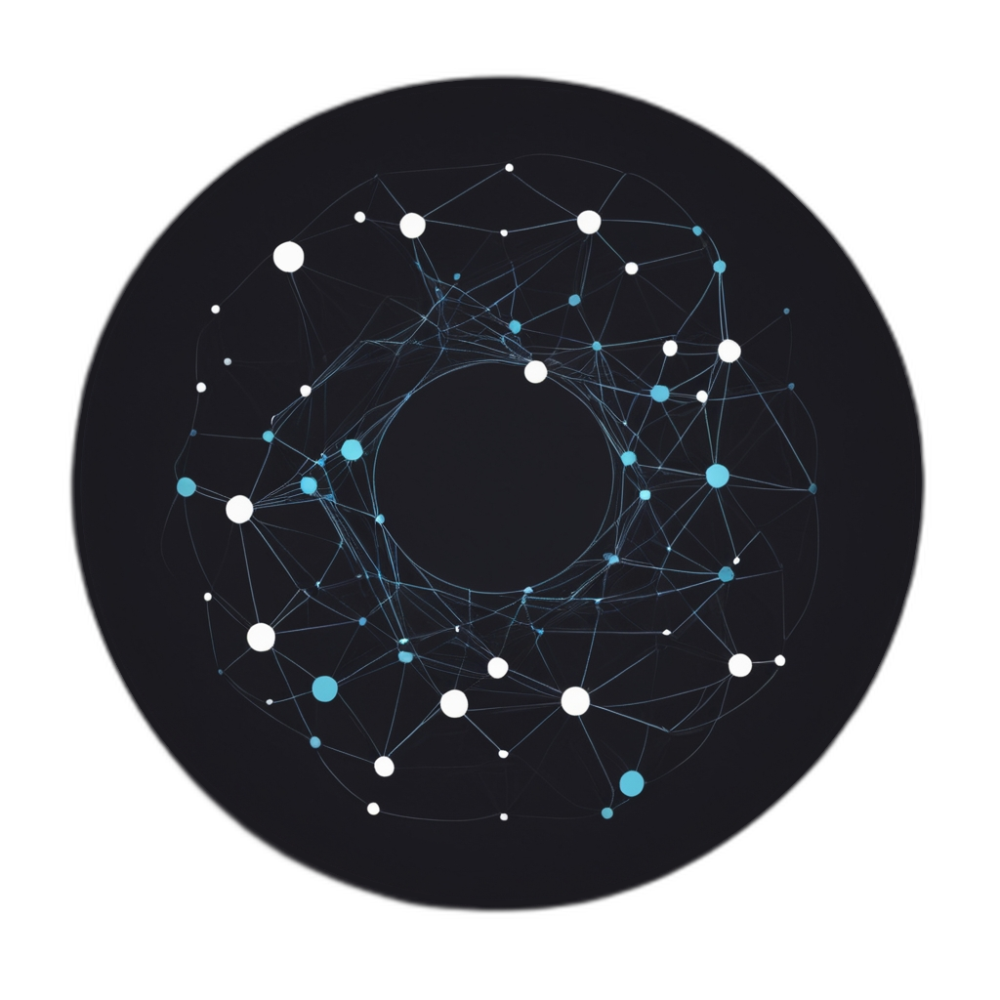

# Zetina

   
     

   
   
   
   
   

The Zetina is a shared peer-to-peer network of Zero-Knowledge Provers. This network allows any party to join and utilize its services, operating with two main user roles:

1. **Delegators**: Users who present jobs to be executed on the network.
2. **Executors**: Users who execute the jobs submitted by Delegators.

## Key Components

### Peer-to-Peer Network of Hosts
This component ensures effective event-driven communication among hosts, facilitating the distribution of tasks and information across the network. Hosts stay updated and informed about new jobs through this network.

### Registry Contract
This component manages the rewarding process for Executors. It verifies and awards Executors for correctly executing jobs and provides a secure platform for Delegators to deposit funds, which are then used to reward Executors.

## Workflow Overview

1. **Delegator Initiates Job**: 
   - The Delegator defines a job, consisting of a Job Header and a Job Body, and stores the Job Body in a Distributed Hash Table (DHT) within the p2p network. The Job Header is then sent using a Gossip-Sub message.

2. **Executor Receives Job**: 
   - An Executor receives and verifies the Job Header. If valid, they retrieve the Job Body from the DHT, check the Delegator's account solvency, and execute the job.

3. **Job Execution**: 
   - The Executor executes the job, producing a Job Witness containing the results and a zero-knowledge proof of correct execution.

4. **Submission and Reward**: 
   - The Executor submits the Job Witness to the Registry. Upon verification of the Delegator's signature, the Registry sends the reward to the Executor.
